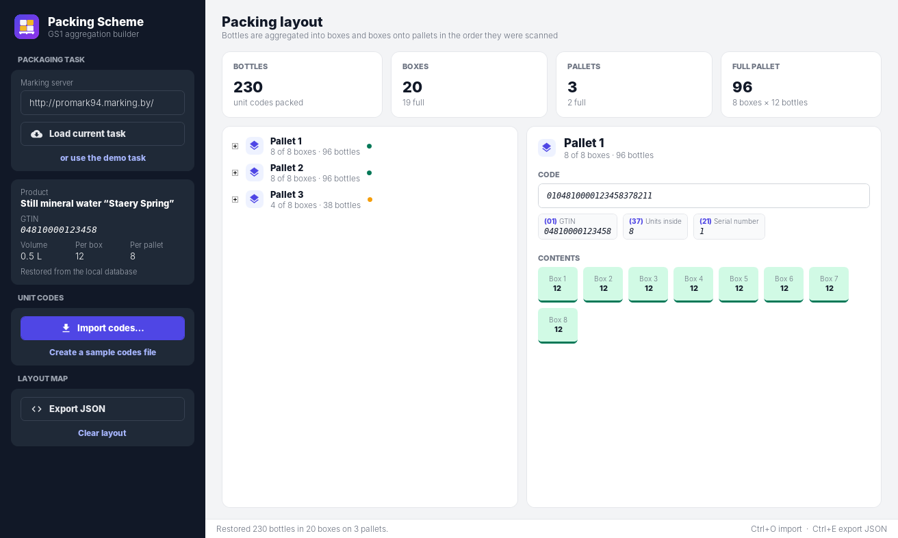
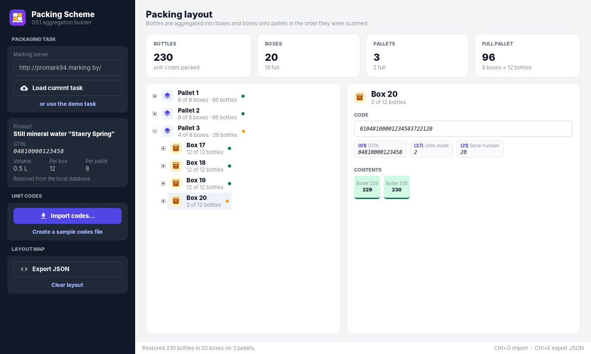
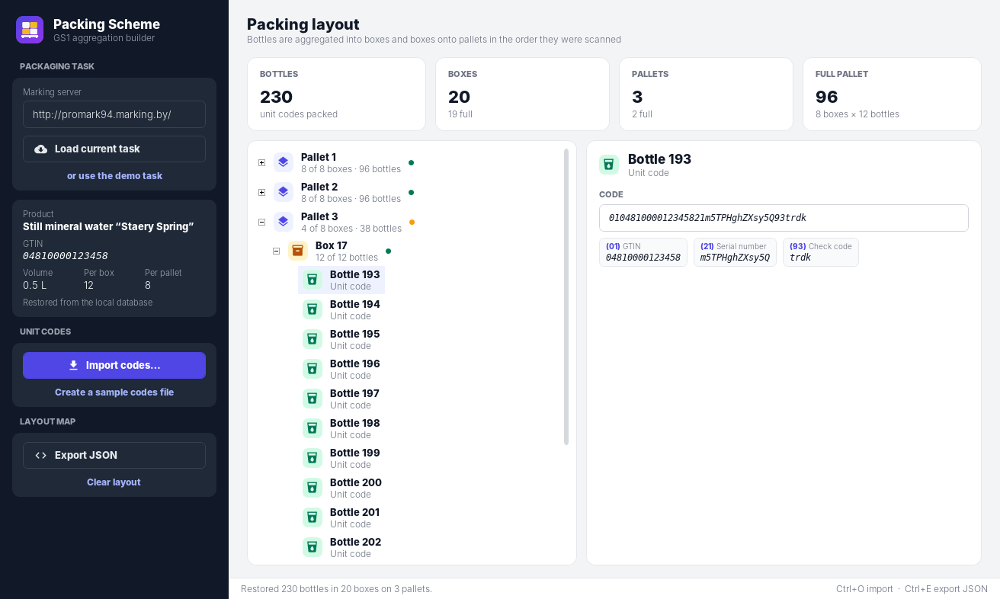
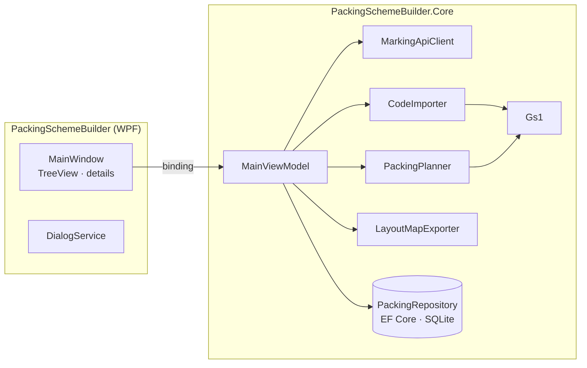

<div align="center">


# Packing Scheme Builder

**A WPF tool for product marking: it aggregates unit codes into boxes and pallets with GS1 codes, stores them in SQLite and exports a JSON layout map.**

[](https://github.com/Staery/PackingSchemeBuilder/actions/workflows/ci.yml)


[](LICENSE)

**English** · [Русский](README.ru.md)

</div>

---

On a bottling line, every bottle carries a DataMatrix code. Packing Scheme Builder takes the **current packaging task**
from the marking server (product, GTIN, bottles per box, boxes per pallet), imports the scanned **unit codes**, and
builds the aggregation hierarchy **pallet → box → bottle**. Every box and pallet gets a GS1 code of the form
`(01) GTIN (37) units inside (21) serial`. The result is saved to SQLite and exported as a JSON **layout map**.

## 📸 Screenshots



| Incomplete last box | Unit code split into GS1 elements |
|---|---|
|  |  |

<sub>The screenshots show the built-in demo task and generated sample codes.</sub>

## ✨ Features

| | |
|---|---|
| 🌐 **Task from the marking server** | `GET client/api/get/task/` from a configurable server address. A **demo task** lets you try the app without one |
| 📥 **Code import** | Strips control characters (the GS separator), accepts only codes that start with `(01)` and the task's GTIN, and skips duplicates and empty lines. A report shows what was accepted and why the rest was skipped |
| 📦 **Aggregation** | Boxes and pallets are filled in scan order; only the last ones can be incomplete. Each container gets a GS1 code with AI (37) set to the number of units inside |
| 🌳 **Hierarchy view** | A pallet → box → bottle tree with completeness markers, a contents overview and the selected code split into GS1 elements |
| 🗄 **SQLite storage** | EF Core with unique indexes and cascade deletes. Each save replaces the data in a single transaction, and the layout is restored on start-up |
| ➕ **Incremental import** | Several files can be imported one after another; codes already packed are recognised as duplicates |
| 🧾 **JSON export** | A layout map in the format the marking system expects: `productName`, `gtin`, `boxFormat`, `palletFormat`, `pallet → boxes → bottles` |
| 🧪 **Sample data** | Generates a file of realistic DataMatrix codes, including a few for another product, so you can see the filtering |

## 🧱 Tech stack

| Area | Technology |
|---|---|
| Runtime | .NET 8, C# 12 |
| UI | WPF: `TreeView` with `HierarchicalDataTemplate`, a custom theme and vector icons |
| Data | **EF Core 8 + SQLite** (`Microsoft.EntityFrameworkCore.Sqlite`), `ExecuteDeleteAsync`, transactions, split queries |
| Domain | GS1: GTIN check digit, element parsing, aggregation codes |
| Architecture | MVVM with [CommunityToolkit.Mvvm](https://learn.microsoft.com/dotnet/communitytoolkit/mvvm/); the API client, repository, settings and dialogs are injected through interfaces |
| Tests | xUnit, 36 tests: GS1, import, planner, JSON export, the repository on a real SQLite file, the HTTP client on a stub handler, and view-model scenarios |
| CI/CD | GitHub Actions: build, test and a self-contained single-file `.exe` |

## 🏗 Architecture



The **packing algorithm is a pure function**: `PackingPlanner.Plan(task, codes)` gives the same result for the same
input and does not touch the database. That makes it easy to test, and the repository only stores the result.

### Project layout

```
PackingSchemeBuilder/
├── src/
│   ├── PackingSchemeBuilder/          # WPF app: window, theme, dialogs
│   └── PackingSchemeBuilder.Core/
│       ├── Models/                    # PackagingTask, PackingResult (pallets, boxes, bottles)
│       ├── Services/                  # Gs1, CodeImporter, PackingPlanner, LayoutMapExporter, MarkingApiClient
│       ├── Data/                      # EF Core DbContext and repository
│       └── ViewModels/
├── tests/PackingSchemeBuilder.Core.Tests/
└── .github/workflows/ci.yml
```

## 🛠 Fixes compared to the first version

- **Aggregation rewritten.** Before, every code opened its own `DbContext` and ran a dozen `Count` queries, making
  import O(n²) with conditions that went wrong at box and pallet boundaries. Now the algorithm runs in memory and the
  result is saved once, in a transaction.
- **Database set-up is consistent.** EF6 migrations and the SQLite.CodeFirst initializer no longer conflict: EF Core
  creates the schema.
- **Product filtering is precise.** Codes are matched with `StartsWith("01" + GTIN)` instead of `Contains(GTIN)`,
  which accepted codes of other products.
- **Re-import is correct.** Data is replaced in a transaction; before, the clean-up was commented out and new codes
  were appended to stale data.
- The server address can be configured and is remembered, instead of being hard-coded.
- The export file name is sortable and zero-padded (`…_layout_20260304_0705.json` instead of `…_342026_75.json`) and is
  chosen in a save dialog, instead of being glued together with `\\`.
- The view model no longer shows `MessageBox` directly, and errors are no longer wrapped three times.

## 🚀 Getting started

Requirements: Windows 10/11 and the [.NET 8 SDK](https://dotnet.microsoft.com/download/dotnet/8.0).

```bash
git clone https://github.com/Staery/PackingSchemeBuilder.git
cd PackingSchemeBuilder
dotnet run --project src/PackingSchemeBuilder
```

**Quick tour without a marking server:** click *or use the demo task* → *Create a sample codes file* → *Import
codes…* → *Export JSON*.

```bash
dotnet test tests/PackingSchemeBuilder.Core.Tests   # runs on any OS
```

Data is stored in `%LOCALAPPDATA%\PackingSchemeBuilder\packing.db`.

## 📄 License

[MIT](LICENSE) © 2024–2026 Anton Selkin
