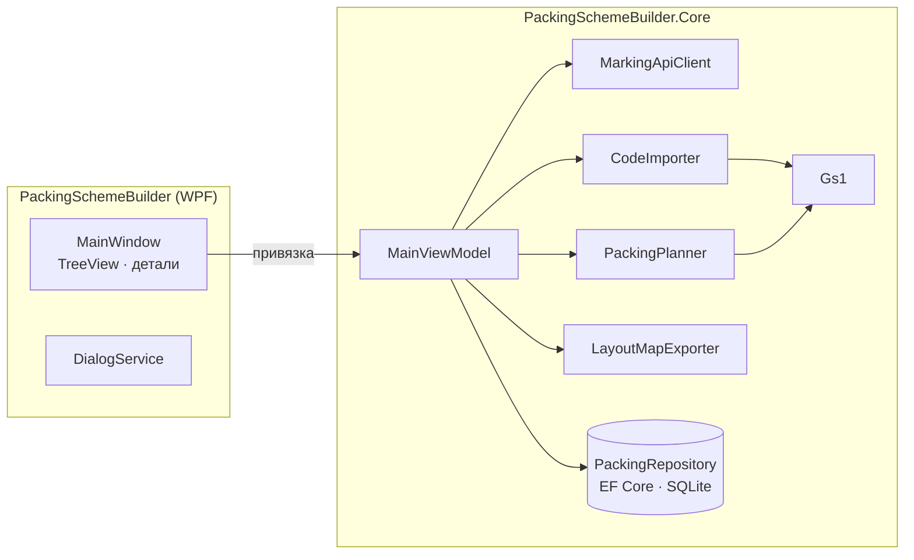

<div align="center">


# Packing Scheme Builder

**WPF-инструмент для маркировки продукции: собирает коды единиц в короба и паллеты с кодами GS1, хранит их в SQLite и выгружает карту раскладки в JSON.**

[](https://github.com/Staery/PackingSchemeBuilder/actions/workflows/ci.yml)


[](LICENSE)

[English](README.md) · **Русский**

</div>

---

На линии розлива на каждую бутылку наносится код DataMatrix. Packing Scheme Builder получает **текущее задание на
упаковку** с сервера маркировки (продукт, GTIN, сколько бутылок в коробе и коробов на паллете), импортирует
отсканированные **коды единиц** и строит иерархию агрегации **паллета → короб → бутылка**. Каждый короб и каждая
паллета получают код GS1 вида `(01) GTIN (37) количество вложений (21) серийный номер`. Результат сохраняется в SQLite
и выгружается в JSON как **карта раскладки**.

## 📸 Скриншоты


| Неполный последний короб | Код единицы, разобранный на элементы GS1 |
|---|---|
|  |  |

<sub>На скриншотах встроенное демо-задание и сгенерированные примеры кодов.</sub>

## ✨ Возможности

| | |
|---|---|
| 🌐 **Задание с сервера маркировки** | `GET client/api/get/task/` с настраиваемым адресом сервера. Без сервера приложение можно попробовать на **демо-задании** |
| 📥 **Импорт кодов** | Удаляет управляющие символы (разделитель GS), принимает только коды, которые начинаются с `(01)` и GTIN задания, пропускает дубли и пустые строки. Отчёт показывает, что принято и почему отброшено остальное |
| 📦 **Агрегация** | Короба и паллеты заполняются в порядке сканирования, неполными могут быть только последние. Каждая тара получает код GS1, где AI (37) — число вложений |
| 🌳 **Дерево иерархии** | Дерево «паллета → короб → бутылка» с отметками заполненности, обзор содержимого и разбор выбранного кода на элементы GS1 |
| 🗄 **Хранение в SQLite** | EF Core с уникальными индексами и каскадным удалением. Каждое сохранение заменяет данные одной транзакцией, а при запуске раскладка восстанавливается |
| ➕ **Пошаговый импорт** | Можно импортировать несколько файлов подряд: уже упакованные коды распознаются как дубли |
| 🧾 **Выгрузка в JSON** | Карта раскладки в формате, который ожидает система маркировки: `productName`, `gtin`, `boxFormat`, `palletFormat`, `pallet → boxes → bottles` |
| 🧪 **Примеры данных** | Генерирует файл с реалистичными кодами DataMatrix, включая несколько кодов другого продукта, чтобы было видно фильтрацию |

## 🧱 Технологии

| Область | Технологии |
|---|---|
| Платформа | .NET 8, C# 12 |
| Интерфейс | WPF: `TreeView` с `HierarchicalDataTemplate`, своя тема и векторные иконки |
| Данные | **EF Core 8 + SQLite** (`Microsoft.EntityFrameworkCore.Sqlite`), `ExecuteDeleteAsync`, транзакции, split queries |
| Предметная область | GS1: контрольная цифра GTIN, разбор элементов, коды агрегации |
| Архитектура | MVVM на [CommunityToolkit.Mvvm](https://learn.microsoft.com/dotnet/communitytoolkit/mvvm/); API-клиент, репозиторий, настройки и диалоги внедряются через интерфейсы |
| Тесты | xUnit, 36 тестов: GS1, импорт, планировщик, выгрузка в JSON, репозиторий на реальном файле SQLite, HTTP-клиент на подменённом обработчике и сценарии ViewModel |
| CI/CD | GitHub Actions: сборка, тесты и самодостаточный `.exe` из одного файла |

## 🏗 Архитектура



**Алгоритм раскладки — чистая функция.** `PackingPlanner.Plan(task, codes)` даёт одинаковый результат на одинаковых
данных и не обращается к базе. Поэтому его легко тестировать, а репозиторий только сохраняет результат.

### Структура проекта

```
PackingSchemeBuilder/
├── src/
│   ├── PackingSchemeBuilder/          # WPF-приложение: окно, тема, диалоги
│   └── PackingSchemeBuilder.Core/
│       ├── Models/                    # PackagingTask, PackingResult (паллеты, короба, бутылки)
│       ├── Services/                  # Gs1, CodeImporter, PackingPlanner, LayoutMapExporter, MarkingApiClient
│       ├── Data/                      # DbContext и репозиторий EF Core
│       └── ViewModels/
├── tests/PackingSchemeBuilder.Core.Tests/
└── .github/workflows/ci.yml
```

## 🛠 Исправления по сравнению с первой версией

- **Агрегация переписана.** Раньше на каждый код открывался свой `DbContext` и выполнялся десяток запросов `Count`,
  поэтому импорт был O(n²), а условия ошибались на границах коробов и паллет. Теперь алгоритм работает в памяти, а
  результат сохраняется один раз, в транзакции.
- **Создание базы приведено к одному механизму.** EF6-миграции и инициализатор SQLite.CodeFirst больше не
  конфликтуют: схему создаёт EF Core.
- **Фильтр по продукту точный.** Коды проверяются через `StartsWith("01" + GTIN)`, а не `Contains(GTIN)`, который
  пропускал коды других продуктов.
- **Повторный импорт работает правильно.** Данные заменяются в транзакции. Раньше очистка была закомментирована, и
  новые коды дописывались к старым данным.
- Адрес сервера можно указать и он запоминается, а не зашит в код.
- Имя файла выгрузки сортируемое и с ведущими нулями (`…_layout_20260304_0705.json` вместо `…_342026_75.json`) и
  выбирается в диалоге сохранения, а не склеивается через `\\`.
- ViewModel больше не показывает `MessageBox` напрямую, а ошибки не оборачиваются трижды.

## 🚀 Быстрый старт

Нужны Windows 10/11 и [.NET 8 SDK](https://dotnet.microsoft.com/download/dotnet/8.0).

```bash
git clone https://github.com/Staery/PackingSchemeBuilder.git
cd PackingSchemeBuilder
dotnet run --project src/PackingSchemeBuilder
```

**Быстрое знакомство без сервера маркировки:** при первом запуске нажмите **Fill with demo codes**. Приложение
возьмёт демо-задание и сразу разложит набор сгенерированных кодов. Чтобы пройти весь сценарий, нажмите *or use the demo
task* → *Create a sample codes file* → *Import codes…* → *Export JSON*.

```bash
dotnet test tests/PackingSchemeBuilder.Core.Tests   # работает на любой ОС
```

Данные хранятся в `%LOCALAPPDATA%\PackingSchemeBuilder\packing.db`.

## 📄 Лицензия

[MIT](LICENSE) © 2024–2026 Anton Selkin
